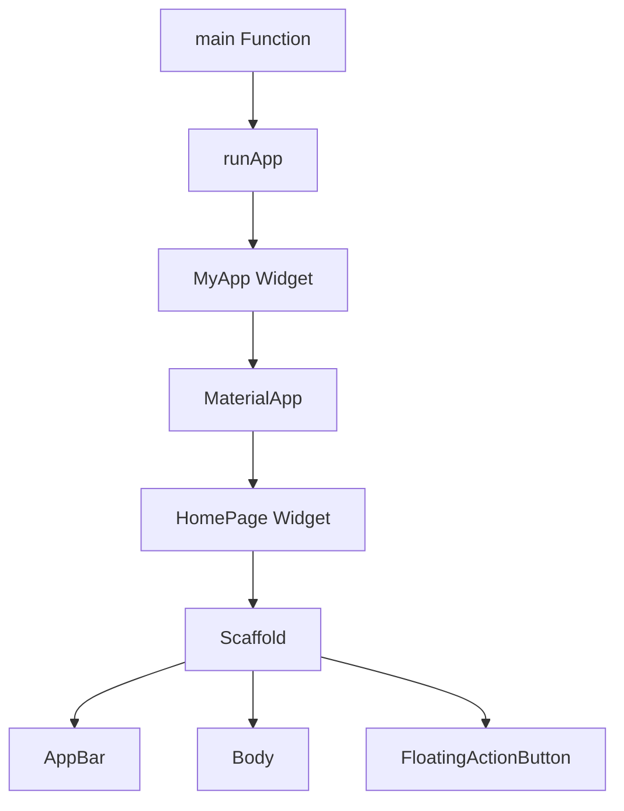

# Flutter শেখার শুরুতে আমাদের কোড flow সম্পর্কে জানতে হবে

```dart
import 'package:flutter/material.dart';

void main() {
  runApp(const MyApp());
}

class MyApp extends StatelessWidget {
  const MyApp({super.key});

  @override
  Widget build(BuildContext context) {
    return MaterialApp(
      debugShowCheckedModeBanner: false, // removes debug banner
      home: const HomePage(),
    );
  }
}

class HomePage extends StatelessWidget {
  const HomePage({super.key});

  @override
  Widget build(BuildContext context) {
    return Scaffold(
      appBar: AppBar(
        title: const Text('My First Flutter App'),
        backgroundColor: Colors.blue,
        centerTitle: true,
      ),
      body: Center(
        child: Column(
          mainAxisAlignment: MainAxisAlignment.center,
          children: [
            const Text(
              'Welcome to Flutter!',
              style: TextStyle(
                fontSize: 24,
                fontWeight: FontWeight.bold,
                color: Colors.blue,
              ),
            ),
            const SizedBox(height: 20),
            Image.asset(
              'assets/flutter_logo.png',
              width: 100,
              height: 100,
            ),
            const SizedBox(height: 20),
            ElevatedButton(
              onPressed: () {
                print('Button Pressed!');
              },
              child: const Text('Click Me'),
            ),
          ],
        ),
      ),
      floatingActionButton: FloatingActionButton(
        onPressed: () {},
        child: const Icon(Icons.add),
      ),
    );
  }
}
```

## কোড ফ্লো ব্যাখ্যা:

### ১. **main() ফাংশন**
```dart
void main() {
  runApp(const MyApp());
}
```
- এপ্লিকেশন শুরু হয় `main()` ফাংশন থেকে
- `runApp()` root widget কে pass করে

### ২. **MyApp ক্লাস**
```dart
class MyApp extends StatelessWidget {
  const MyApp({super.key});

  @override
  Widget build(BuildContext context) {
    return MaterialApp(
      debugShowCheckedModeBanner: false,
      home: const HomePage(),
    );
  }
}
```
- `MaterialApp` return করে (Material Design theme)
- `home` property প্রথম screen নির্ধারণ করে

### ৩. **HomePage ক্লাস**
```dart
class HomePage extends StatelessWidget {
  const HomePage({super.key});

  @override
  Widget build(BuildContext context) {
    return Scaffold(
      // UI components here
    );
  }
}
```
- `Scaffold` ব্যবহার করে basic layout structure তৈরি করে
- AppBar, Body, FloatingActionButton ইত্যাদি থাকে

## সম্পূর্ণ ফ্লো চার্ট:
```
main() → runApp() → MyApp() → MaterialApp() → HomePage() → Scaffold()
```

