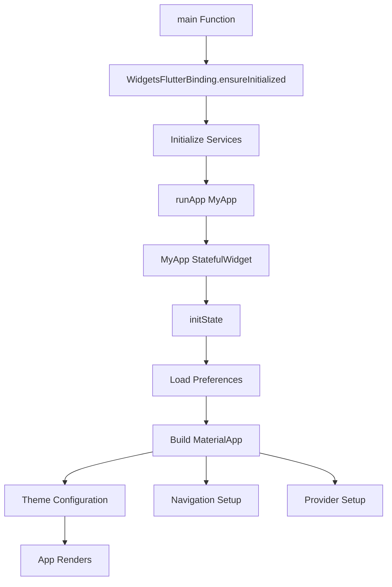

# Main Function, runApp এবং MyApp Widget - সম্পূর্ণ গাইড

## ১. Main Function (মেইন ফাংশন)

### Main Function কি?
**Main Function** হলো Dart language-এর entry point। Every Flutter app এ একটি main function থাকতেই হবে।

```dart
void main() {
  // এখানে app start হয়
  runApp(MyApp());
}
```

### বিভিন্ন ভাবে main function লিখা যায়:

#### সাধারণ way:
```dart
void main() {
  runApp(MyApp());
}
```

#### Short way (Arrow function):
```dart
void main() => runApp(MyApp());
```

#### Advanced way (Error handling সহ):
```dart
void main() {
  // Error handling setup
  FlutterError.onError = (details) {
    print('Flutter Error: ${details.exception}');
  };
  
  // Run the app
  runApp(MyApp());
}
```

#### Professional way (With initialization):
```dart
Future<void> main() async {
  // Ensure Flutter is initialized
  WidgetsFlutterBinding.ensureInitialized();
  
  // Initialize plugins or services
  await Firebase.initializeApp();
  await Hive.initFlutter();
  
  // Run the app
  runApp(MyApp());
}
```

---

## ২. runApp Function (রানঅ্যাপ ফাংশন)

### runApp কি?
**runApp** হলো Flutter-এর একটি built-in function যা app-এর root widget কে run করে।

```dart
runApp(Widget app)
```

### runApp-এর বিভিন্ন ব্যবহার:

#### সাধারণ ব্যবহার:
```dart
void main() {
  runApp(MyApp());
}
```

#### Direct widget pass করা:
```dart
void main() {
  runApp(
    MaterialApp(
      home: Scaffold(
        body: Center(child: Text('Hello World')),
      ),
    ),
  );
}
```

#### With Provider/Wrap করা:
```dart
void main() {
  runApp(
    MultiProvider(
      providers: [
        ChangeNotifierProvider(create: (_) => CounterModel()),
      ],
      child: MyApp(),
    ),
  );
}
```

#### Error boundary সহ:
```dart
void main() {
  runApp(
    ErrorBoundary(
      child: MyApp(),
    ),
  );
}
```

---

## ৩. MyApp Widget (মাইঅ্যাপ উইজেট)

### MyApp Widget কি?
**MyApp** হলো একটি custom widget যা সাধারণত MaterialApp বা CupertinoApp return করে।

### MyApp-এর বিভিন্ন ধরন:

#### ১. StatelessWidget হিসেবে:
```dart
class MyApp extends StatelessWidget {
  const MyApp({super.key});

  @override
  Widget build(BuildContext context) {
    return MaterialApp(
      title: 'My Flutter App',
      theme: ThemeData(primarySwatch: Colors.blue),
      home: HomeScreen(),
    );
  }
}
```

#### ২. StatefulWidget হিসেবে (যদি dynamic theme বা configuration দরকার):
```dart
class MyApp extends StatefulWidget {
  const MyApp({super.key});

  @override
  State<MyApp> createState() => _MyAppState();
}

class _MyAppState extends State<MyApp> {
  bool _isDarkMode = false;

  void _toggleTheme() {
    setState(() {
      _isDarkMode = !_isDarkMode;
    });
  }

  @override
  Widget build(BuildContext context) {
    return MaterialApp(
      title: 'Theme Changer App',
      theme: _isDarkMode ? ThemeData.dark() : ThemeData.light(),
      home: HomeScreen(onThemeToggle: _toggleTheme),
    );
  }
}
```

#### ৩. InheritedWidget হিসেবে (Advanced):
```dart
class MyApp extends InheritedWidget {
  final AppConfig config;

  const MyApp({
    super.key,
    required this.config,
    required super.child,
  });

  static MyApp of(BuildContext context) {
    return context.dependOnInheritedWidgetOfExactType<MyApp>()!;
  }

  @override
  bool updateShouldNotify(MyApp oldWidget) {
    return config != oldWidget.config;
  }
}
```

---

## সম্পূর্ণ উদাহরণ: Beginner to Advanced

### উদাহরণ ১: সম্পূর্ণ Beginner Version
```dart
import 'package:flutter/material.dart';

// 1. Main Function
void main() {
  // 2. runApp Call
  runApp(const MyApp());
}

// 3. MyApp Widget
class MyApp extends StatelessWidget {
  const MyApp({super.key});

  @override
  Widget build(BuildContext context) {
    return MaterialApp(
      title: 'Simple App',
      home: Scaffold(
        appBar: AppBar(title: Text('My First App')),
        body: Center(child: Text('Hello World!')),
      ),
    );
  }
}
```

### উদাহরণ ২: Intermediate Version (With Routes)
```dart
import 'package:flutter/material.dart';

void main() => runApp(const MyApp());

class MyApp extends StatelessWidget {
  const MyApp({super.key});

  @override
  Widget build(BuildContext context) {
    return MaterialApp(
      title: 'Intermediate App',
      theme: ThemeData(
        primarySwatch: Colors.blue,
        useMaterial3: true,
      ),
      
      // Home Route
      home: const HomeScreen(),
      
      // Named Routes
      routes: {
        '/home': (context) => const HomeScreen(),
        '/profile': (context) => const ProfileScreen(),
        '/settings': (context) => const SettingsScreen(),
      },
      
      // Unknown Route Handler
      onGenerateRoute: (settings) {
        return MaterialPageRoute(
          builder: (context) => const NotFoundScreen(),
        );
      },
      
      debugShowCheckedModeBanner: false,
    );
  }
}

// Example Screens
class HomeScreen extends StatelessWidget {
  const HomeScreen({super.key});

  @override
  Widget build(BuildContext context) {
    return Scaffold(
      appBar: AppBar(title: const Text('Home')),
      body: Center(
        child: Column(
          mainAxisAlignment: MainAxisAlignment.center,
          children: [
            const Text('Welcome to Home Screen'),
            ElevatedButton(
              onPressed: () {
                Navigator.pushNamed(context, '/profile');
              },
              child: const Text('Go to Profile'),
            ),
          ],
        ),
      ),
    );
  }
}

class ProfileScreen extends StatelessWidget {
  const ProfileScreen({super.key});

  @override
  Widget build(BuildContext context) {
    return Scaffold(
      appBar: AppBar(title: const Text('Profile')),
      body: const Center(child: Text('Profile Screen')),
    );
  }
}

class SettingsScreen extends StatelessWidget {
  const SettingsScreen({super.key});

  @override
  Widget build(BuildContext context) {
    return Scaffold(
      appBar: AppBar(title: const Text('Settings')),
      body: const Center(child: Text('Settings Screen')),
    );
  }
}

class NotFoundScreen extends StatelessWidget {
  const NotFoundScreen({super.key});

  @override
  Widget build(BuildContext context) {
    return Scaffold(
      body: Center(child: Text('404 - Page Not Found')),
    );
  }
}
```

### উদাহরণ ৩: Advanced Version (Professional App)
```dart
import 'package:flutter/material.dart';
import 'package:flutter/services.dart';
import 'package:provider/provider.dart';

// 1. Advanced Main Function with Initialization
Future<void> main() async {
  // Ensure Flutter is ready
  WidgetsFlutterBinding.ensureInitialized();
  
  // Set preferred orientations
  await SystemChrome.setPreferredOrientations([
    DeviceOrientation.portraitUp,
    DeviceOrientation.portraitDown,
  ]);
  
  // Initialize services
  await initializeAppServices();
  
  // Run the app with error handling
  runApp(
    // Global error boundary
    ErrorHandlingWidget(
      child: MultiProvider(
        providers: [
          ChangeNotifierProvider(create: (_) => ThemeProvider()),
          ChangeNotifierProvider(create: (_) => UserProvider()),
          ChangeNotifierProvider(create: (_) => AppStateProvider()),
        ],
        child: const MyApp(),
      ),
    ),
  );
}

// 2. Advanced MyApp Widget
class MyApp extends StatefulWidget {
  const MyApp({super.key});

  @override
  State<MyApp> createState() => _MyAppState();
}

class _MyAppState extends State<MyApp> with WidgetsBindingObserver {
  @override
  void initState() {
    super.initState();
    WidgetsBinding.instance.addObserver(this);
    _initializeApp();
  }

  @override
  void dispose() {
    WidgetsBinding.instance.removeObserver(this);
    super.dispose();
  }

  Future<void> _initializeApp() async {
    // Load user preferences
    await context.read<ThemeProvider>().loadPreferences();
    await context.read<UserProvider>().loadUserData();
  }

  @override
  void didChangeAppLifecycleState(AppLifecycleState state) {
    // Handle app lifecycle changes
    print('App State: $state');
  }

  @override
  Widget build(BuildContext context) {
    final themeProvider = Provider.of<ThemeProvider>(context);
    
    return MaterialApp(
      title: 'Professional Flutter App',
      
      // Dynamic Theme
      theme: themeProvider.lightTheme,
      darkTheme: themeProvider.darkTheme,
      themeMode: themeProvider.themeMode,
      
      // Navigation
      initialRoute: '/splash',
      onGenerateRoute: RouteGenerator.generateRoute,
      navigatorKey: NavigationService.navigatorKey,
      navigatorObservers: [
        AnalyticsObserver(),
        RouteLogger(),
      ],
      
      // Localization
      supportedLocales: const [
        Locale('en', 'US'),
        Locale('bn', 'BD'),
      ],
      localizationsDelegates: const [
        // ... localization delegates
      ],
      
      // Performance & Debug
      debugShowCheckedModeBanner: false,
      showPerformanceOverlay: false,
      
      // Builder for global configurations
      builder: (context, child) {
        return MediaQuery(
          data: MediaQuery.of(context).copyWith(
            textScaleFactor: 1.0, // Prevent text scaling
          ),
          child: child!,
        );
      },
    );
  }
}

// Supporting Classes

class ThemeProvider with ChangeNotifier {
  ThemeMode _themeMode = ThemeMode.system;
  
  ThemeMode get themeMode => _themeMode;
  
  ThemeData get lightTheme => ThemeData.light().copyWith(
        primaryColor: Colors.blue.shade800,
        colorScheme: ColorScheme.fromSwatch(
          primarySwatch: Colors.blue,
          accentColor: Colors.orange,
        ),
      );
  
  ThemeData get darkTheme => ThemeData.dark().copyWith(
        colorScheme: ColorScheme.dark(
          primary: Colors.blueAccent,
          secondary: Colors.orangeAccent,
        ),
      );
  
  Future<void> loadPreferences() async {
    // Load theme preference from storage
  }
  
  void setTheme(ThemeMode mode) {
    _themeMode = mode;
    notifyListeners();
  }
}

class RouteGenerator {
  static Route<dynamic> generateRoute(RouteSettings settings) {
    switch (settings.name) {
      case '/':
        return MaterialPageRoute(builder: (_) => const SplashScreen());
      case '/home':
        return MaterialPageRoute(builder: (_) => const HomeScreen());
      case '/profile':
        return MaterialPageRoute(builder: (_) => const ProfileScreen());
      default:
        return MaterialPageRoute(builder: (_) => const NotFoundScreen());
    }
  }
}

class NavigationService {
  static final GlobalKey<NavigatorState> navigatorKey = 
      GlobalKey<NavigatorState>();
}

class AnalyticsObserver extends RouteObserver<PageRoute<dynamic>> {
  @override
  void didPush(Route<dynamic> route, Route<dynamic>? previousRoute) {
    super.didPush(route, previousRoute);
    // Track screen view
  }
}

class RouteLogger extends RouteObserver<PageRoute<dynamic>> {
  @override
  void didPush(Route<dynamic> route, Route<dynamic>? previousRoute) {
    print('Route pushed: ${route.settings.name}');
  }
}

class ErrorHandlingWidget extends StatelessWidget {
  final Widget child;
  
  const ErrorHandlingWidget({super.key, required this.child});
  
  @override
  Widget build(BuildContext context) {
    return child;
  }
}

// Initialize app services
Future<void> initializeAppServices() async {
  // Initialize databases, APIs, etc.
  await Future.delayed(const Duration(milliseconds: 100));
}

// Example screens
class SplashScreen extends StatelessWidget {
  const SplashScreen({super.key});

  @override
  Widget build(BuildContext context) {
    return const Scaffold(
      body: Center(child: CircularProgressIndicator()),
    );
  }
}

class HomeScreen extends StatelessWidget {
  const HomeScreen({super.key});

  @override
  Widget build(BuildContext context) {
    return Scaffold(
      appBar: AppBar(title: const Text('Home')),
      body: const Center(child: Text('Home Screen')),
    );
  }
}
```

---

## Flow Chart (ফ্লো চার্ট)



## Common Patterns (কমন প্যাটার্ন)

### Pattern ১: Simple App
```dart
void main() => runApp(MyApp());

class MyApp extends StatelessWidget {
  @override
  Widget build(BuildContext context) {
    return MaterialApp(home: HomePage());
  }
}
```

### Pattern ২: App with Theme
```dart
void main() => runApp(MyApp());

class MyApp extends StatelessWidget {
  @override
  Widget build(BuildContext context) {
    return MaterialApp(
      theme: ThemeData.dark(),
      home: HomePage(),
    );
  }
}
```

### Pattern ৩: App with State Management
```dart
void main() => runApp(
  Provider(
    create: (_) => CounterModel(),
    child: MyApp(),
  ),
);

class MyApp extends StatelessWidget {
  @override
  Widget build(BuildContext context) {
    return MaterialApp(home: HomePage());
  }
}
```

এই structure follow করলে আপনার Flutter app professional এবং maintainable হবে! 🚀
